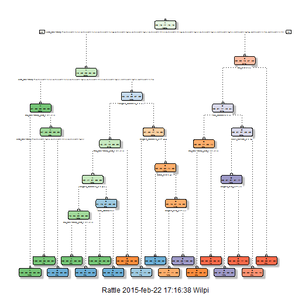

markdownToHTML("final_job.md", "final_job.html")


```r
library(rpart)
library(rpart.plot)
library(RColorBrewer)
library(rattle)
```


```r
options(warn=-1)
library(caret)
library(randomForest)
library(Hmisc)
library(foreach)
library(doParallel)
set.seed(12345)
```


```r
#summary(training)
#describe(training)
#sapply(data, class)
#str(data)
```

```


```r
inTrain <- createDataPartition(y=training$classe, p=0.6, list=FALSE)
myTraining <- training[inTrain, ]; myTesting <- training[-inTrain, ]
dim(myTraining); dim(myTesting)
```

```
## [1] 11776   160
```

```
## [1] 7846  160
```

```r
myDataNZV <- nearZeroVar(myTraining, saveMetrics=TRUE)
myNZVvars <- names(myTraining) %in% c("new_window", "kurtosis_roll_belt", "kurtosis_picth_belt",
"kurtosis_yaw_belt", "skewness_roll_belt", "skewness_roll_belt.1", "skewness_yaw_belt",
"max_yaw_belt", "min_yaw_belt", "amplitude_yaw_belt", "avg_roll_arm", "stddev_roll_arm",
"var_roll_arm", "avg_pitch_arm", "stddev_pitch_arm", "var_pitch_arm", "avg_yaw_arm",
"stddev_yaw_arm", "var_yaw_arm", "kurtosis_roll_arm", "kurtosis_picth_arm",
"kurtosis_yaw_arm", "skewness_roll_arm", "skewness_pitch_arm", "skewness_yaw_arm",
"max_roll_arm", "min_roll_arm", "min_pitch_arm", "amplitude_roll_arm", "amplitude_pitch_arm",
"kurtosis_roll_dumbbell", "kurtosis_picth_dumbbell", "kurtosis_yaw_dumbbell", "skewness_roll_dumbbell",
"skewness_pitch_dumbbell", "skewness_yaw_dumbbell", "max_yaw_dumbbell", "min_yaw_dumbbell",
"amplitude_yaw_dumbbell", "kurtosis_roll_forearm", "kurtosis_picth_forearm", "kurtosis_yaw_forearm",
"skewness_roll_forearm", "skewness_pitch_forearm", "skewness_yaw_forearm", "max_roll_forearm",
"max_yaw_forearm", "min_roll_forearm", "min_yaw_forearm", "amplitude_roll_forearm",
"amplitude_yaw_forearm", "avg_roll_forearm", "stddev_roll_forearm", "var_roll_forearm",
"avg_pitch_forearm", "stddev_pitch_forearm", "var_pitch_forearm", "avg_yaw_forearm",
"stddev_yaw_forearm", "var_yaw_forearm")
myTraining <- myTraining[!myNZVvars]
#To check the new N?? of observations
dim(myTraining)
```

```
## [1] 11776   100
```


```r
myTraining <- myTraining[c(-1)]
modFitA1 <- rpart(classe ~ ., data=myTraining, method="class")
```


```r
fancy<-fancyRpartPlot(modFitA1)
```

 


