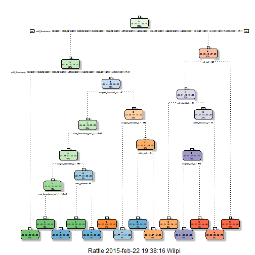

markdownToHTML("final_job.md", "final_job.html")

## Preparando los dato


```r
library(rpart)
library(rpart.plot)
library(RColorBrewer)
library(rattle)
```


```r
options(warn=-1)
library(caret)
library(randomForest)
library(Hmisc)
library(foreach)
library(doParallel)
set.seed(1235)
```
## Lectura de Datos cargados


```


```r
inTrain <- createDataPartition(y=training$classe, p=0.6, list=FALSE)
witraining <- training[inTrain, ]; myTesting <- training[-inTrain, ]
dim(witraining); dim(myTesting)
```

```
## [1] 11776   160
```

```
## [1] 7846  160
```

```r
##Cleaning

metricdata <- nearZeroVar(witraining, saveMetrics=TRUE)
metricvars <- names(witraining) %in% c("new_window", "kurtosis_roll_belt", "kurtosis_picth_belt",
"kurtosis_yaw_belt", "skewness_roll_belt", "skewness_roll_belt.1", "skewness_yaw_belt",
"max_yaw_belt", "min_yaw_belt", "amplitude_yaw_belt", "avg_roll_arm", "stddev_roll_arm",
"var_roll_arm", "avg_pitch_arm", "stddev_pitch_arm", "var_pitch_arm", "avg_yaw_arm",
"stddev_yaw_arm", "var_yaw_arm", "kurtosis_roll_arm", "kurtosis_picth_arm",
"kurtosis_yaw_arm", "skewness_roll_arm", "skewness_pitch_arm", "skewness_yaw_arm",
"max_roll_arm", "min_roll_arm", "min_pitch_arm", "amplitude_roll_arm", "amplitude_pitch_arm",
"kurtosis_roll_dumbbell", "kurtosis_picth_dumbbell", "kurtosis_yaw_dumbbell", "skewness_roll_dumbbell",
"skewness_pitch_dumbbell", "skewness_yaw_dumbbell", "max_yaw_dumbbell", "min_yaw_dumbbell",
"amplitude_yaw_dumbbell", "kurtosis_roll_forearm", "kurtosis_picth_forearm", "kurtosis_yaw_forearm",
"skewness_roll_forearm", "skewness_pitch_forearm", "skewness_yaw_forearm", "max_roll_forearm",
"max_yaw_forearm", "min_roll_forearm", "min_yaw_forearm", "amplitude_roll_forearm",
"amplitude_yaw_forearm", "avg_roll_forearm", "stddev_roll_forearm", "var_roll_forearm",
"avg_pitch_forearm", "stddev_pitch_forearm", "var_pitch_forearm", "avg_yaw_forearm",
"stddev_yaw_forearm", "var_yaw_forearm")
witraining <- witraining[!metricvars]
#To check the new N?? of observations
dim(witraining)
```

```
## [1] 11776   100
```


Transformation 2: Killing first column of Dataset - ID Removing first ID variable so that it does not interfer with ML Algorithms:


```r
witraining <- witraining[c(-1)]
modFitA1 <- rpart(classe ~ ., data=witraining, method="class")
```

Transformation 3: Cleaning Variables with too many NAs. For Variables that have more than a 60% threshold of NA's I'm going to leave them out:


```r
trainingV3 <- witraining #creating another subset to iterate in loop
for(i in 1:length(witraining)) { #for every column in the training dataset
        if( sum( is.na( witraining[, i] ) ) /nrow(witraining) >= .6 ) { #if n?? NAs > 60% of total observations
        for(j in 1:length(trainingV3)) {
            if( length( grep(names(witraining[i]), names(trainingV3)[j]) ) ==1)  { #if the columns are the same:
                trainingV3 <- trainingV3[ , -j] #Remove that column
            }   
        } 
    }
}
```


```r
#Seting back to our set:
witraining <- trainingV3
rm(trainingV3)
```

Now let us do the exact same 3 transformations but for our myTesting and testing data sets.


```r
clean1 <- colnames(witraining)
clean2 <- colnames(witraining[, -58]) #already with classe column removed
myTesting <- myTesting[clean1]
testing <- testing[clean2]

#To check the new N?? of observations
dim(myTesting)
```

```
## [1] 7846   58
```


```r
dim(testing)
```

```
## [1] 20 57
```


```r
for (i in 1:length(testing) ) {
        for(j in 1:length(witraining)) {
        if( length( grep(names(witraining[i]), names(testing)[j]) ) ==1)  {
            class(testing[j]) <- class(witraining[i])
        }      
    }      
}
#And to make sure Coertion really worked, simple smart ass technique:
testing <- rbind(witraining[2, -58] , testing) #note row 2 does not mean anything, this will be removed right.. now:
testing <- testing[-1,]
```


```r
fancywi<-fancyRpartPlot(modFitA1)
```

 

Predicting:


```r
predictionsA1 <- predict(modFitA1, myTesting, type = "class", na.action = na.omit)
```

```
## Error in eval(expr, envir, enclos): object 'max_roll_belt' not found
```


```r
confusionMatrix(predictionsA1, myTesting$classe)
```

```
## Confusion Matrix and Statistics
## 
##           Reference
## Prediction    A    B    C    D    E
##          A 2150   60    7    1    0
##          B   61 1260   69   64    0
##          C   21  188 1269  143    4
##          D    0   10   14  857   78
##          E    0    0    9  221 1360
## 
## Overall Statistics
##                                           
##                Accuracy : 0.8789          
##                  95% CI : (0.8715, 0.8861)
##     No Information Rate : 0.2845          
##     P-Value [Acc > NIR] : < 2.2e-16       
##                                           
##                   Kappa : 0.8468          
##  Mcnemar's Test P-Value : NA              
## 
## Statistics by Class:
## 
##                      Class: A Class: B Class: C Class: D Class: E
## Sensitivity            0.9633   0.8300   0.9276   0.6664   0.9431
## Specificity            0.9879   0.9693   0.9450   0.9845   0.9641
## Pos Pred Value         0.9693   0.8666   0.7809   0.8936   0.8553
## Neg Pred Value         0.9854   0.9596   0.9841   0.9377   0.9869
## Prevalence             0.2845   0.1935   0.1744   0.1639   0.1838
## Detection Rate         0.2740   0.1606   0.1617   0.1092   0.1733
## Detection Prevalence   0.2827   0.1853   0.2071   0.1222   0.2027
## Balanced Accuracy      0.9756   0.8997   0.9363   0.8254   0.9536
```
##Using ML algorithms for prediction: Random Forests


```r
modFitB1 <- randomForest(classe ~. , data=witraining, na.action = na.omit)
```


Predicting in-sample error:

```r
predictionsB1 <- predict(modFitB1, myTesting, type = "class")
```


(Moment of truth) Using confusion Matrix to test results:


```r
confusionMatrix(predictionsB1, myTesting$classe)
```

```
## Confusion Matrix and Statistics
## 
##           Reference
## Prediction    A    B    C    D    E
##          A 2232    1    0    0    0
##          B    0 1517    1    0    0
##          C    0    0 1365    2    0
##          D    0    0    2 1284    1
##          E    0    0    0    0 1441
## 
## Overall Statistics
##                                           
##                Accuracy : 0.9991          
##                  95% CI : (0.9982, 0.9996)
##     No Information Rate : 0.2845          
##     P-Value [Acc > NIR] : < 2.2e-16       
##                                           
##                   Kappa : 0.9989          
##  Mcnemar's Test P-Value : NA              
## 
## Statistics by Class:
## 
##                      Class: A Class: B Class: C Class: D Class: E
## Sensitivity            1.0000   0.9993   0.9978   0.9984   0.9993
## Specificity            0.9998   0.9998   0.9997   0.9995   1.0000
## Pos Pred Value         0.9996   0.9993   0.9985   0.9977   1.0000
## Neg Pred Value         1.0000   0.9998   0.9995   0.9997   0.9998
## Prevalence             0.2845   0.1935   0.1744   0.1639   0.1838
## Detection Rate         0.2845   0.1933   0.1740   0.1637   0.1837
## Detection Prevalence   0.2846   0.1935   0.1742   0.1640   0.1837
## Balanced Accuracy      0.9999   0.9996   0.9987   0.9990   0.9997
```

Random Forests yielded better Results, as expected!

## Generating Files to submit as answers for the Assignment:

Finally, using the provided Test Set out-of-sample error.

For Random Forests we use the following formula, which yielded a much better prediction in in-sample:


```r
predictionsB2 <- predict(modFitB1, testing, type = "class")
```


```r
pml_write_files = function(x){
  n = length(x)
 for(i in 1:n){
   filename = paste0("problem_id_",i,".txt")
    write.table(x[i],file=filename,quote=FALSE,row.names=FALSE,col.names=FALSE)
  }
}

pml_write_files(predictionsB2)
```


